# InsightInvest

**InsightInvest** is an AI-powered chatbot designed to democratize financial intelligence. It acts as a personal investment research analyst, performing deep, multi-faceted research on any publicly traded company to generate a comprehensive investment outlook report.

✨ [View the Live Demo](https://insight-invest.vercel.app/) ✨

---

## 🚀 Core Features

- **🤖 Conversational Interface:**  
  Simply enter a company name or stock ticker (e.g., "Nvidia", "AAPL", "RELIANCE.NS") to begin the analysis.

- **🌐 Dynamic Web Research:**  
  Gathers real-time news articles and press releases from Google News to gauge market perception.

- **📊 Quantitative Financial Analysis:**  
  Integrates with the Yahoo Finance API to fetch and interpret key financial metrics like P/E Ratio, EPS, Debt-to-Equity, and revenue trends.

- **🧠 Advanced Sentiment Analysis:**  
  Uses the FinBERT model, specialized for financial text, to perform nuanced sentiment analysis on news headlines, assessing if the market sentiment is positive, negative, or neutral.

- **🔮 AI-Powered Predictive Modeling:**  
  Employs a sophisticated hybrid forecasting model (ARIMA + Holt-Winters) and fuses it with the news sentiment score to predict potential future stock price movements, complete with a visual chart and confidence intervals.

- **📝 Comprehensive Report Generation:**  
  Leverages Google's Gemini LLM to synthesize all the gathered qualitative and quantitative data into a coherent, professional, and easy-to-read investment report.

---

## 🛠️ Technology Stack & Architecture

The project is a monorepo containing a separate frontend and backend, ensuring a clean separation of concerns.

| Component | Technology                          |
| --------- | --------------------------------- |
| Frontend  | Next.js, React, TypeScript, Tailwind CSS |
| Backend   | Python, FastAPI (API), Gunicorn (production) |
| AI & Data | Google Gemini (Report Generation), Hugging Face FinBERT (Sentiment), yfinance (Financial Data), Statsmodels (Forecasting) |

### System Architecture

```mermaid
---
config:
  theme: dark
  look: neo
---
graph TD
    subgraph "User's Browser"
        User>👨‍💻 User]
    end

    subgraph "Frontend (Hosted on Vercel)"
        Frontend[Next.js UI]
    end

    subgraph "Backend (Hosted on Render)"
        API[⚡ FastAPI Endpoint]
        Engine[🤖 AI Core Logic]
    end

    subgraph "External AI & Data Services"
        Aggregation[<b>Step 3:</b><br>Gathers &amp; Processes External Data]
        Feature1[<b>Quantitative Analysis</b><br>Yahoo Finance API]
        Feature2[<b>Dynamic Web Research</b><br>Google News RSS]
        Feature3[<b>Sentiment Analysis</b><br>Hugging Face FinBERT]
        Feature4[<b>Predictive Modeling</b><br>ARIMA + Holt-Winters]
        Feature5[<b>Report Generation</b><br>Google Gemini LLM]
    end

    %% --- Data Flow ---
    User -- "1.Enters Ticker" --> Frontend
    Frontend -- "2.API Request" --> API
    API -- "3.Triggers Core Logic" --> Engine
    Engine -- "4.Gathers &amp; Processes Data" --> Aggregation
    Aggregation --> Feature1
    Aggregation --> Feature2
    Aggregation --> Feature3
    Engine -- "5.Runs Internal Models" --> Feature4
    Engine -- "6.Synthesizes All Data" --> Feature5
    Engine -- "7.Returns Final Report" --> API
    API -- "8.Sends Response to Frontend" --> Frontend
    Frontend -- "9.Displays Report &amp; Chart" --> User

    %% --- Styling (Dark Mode Friendly) ---
    style User fill:#2d6cdf,stroke:#ffffff,stroke-width:1.5px,color:#ffffff
    style Frontend fill:#3a8ef6,stroke:#ffffff,stroke-width:2px,color:#ffffff
    style API fill:#1ecf77,stroke:#ffffff,stroke-width:2px,color:#000000
    style Engine fill:#28b463,stroke:#ffffff,stroke-width:2px,color:#000000
    style Aggregation fill:#f4d03f,stroke:#ffffff,stroke-width:1.5px,color:#000000
    style Feature1 fill:#f5b041,stroke:#ffffff,color:#000000
    style Feature2 fill:#f5b041,stroke:#ffffff,color:#000000
    style Feature3 fill:#f5b041,stroke:#ffffff,color:#000000
    style Feature4 fill:#f8c471,stroke:#ffffff,color:#000000
    style Feature5 fill:#f5b041,stroke:#ffffff,color:#000000

```



---

## ⚙️ Getting Started: Running Locally

Follow these instructions to get a copy of the project up and running on your local machine for development and testing purposes.

### Prerequisites

* Git
* Python 3.10+
* Node.js and npm

### 1. Clone the Repository

```bash
git clone https://github.com/your-username/InsightInvest.git
cd InsightInvest
```

### 2. Set Up Environment Variables

The project requires API keys for Alpha Vantage, Google Gemini, and Hugging Face.

Create a file named `.env` in the backend folder.
Open `.env` and add your API keys:

```env
# .env
ALPHA_VANTAGE_API_KEY=alpha_vantage_api_key_here
GEMINI_API_KEY=gemini_api_key_here
HF_API_KEY=hugging_face_api_key_here
```

### 3. Backend Setup (FastAPI)

```bash
# Navigate to the backend directory
cd backend

# Create and activate a virtual environment
python -m venv venv
source venv/bin/activate  # On Windows, use: venv\Scripts\activate

# Install Python dependencies
pip install -r requirements.txt

# Start the backend server
uvicorn main:app --host 127.0.0.1 --port 8000 --reload
```

The backend API will now be running at `http://127.0.0.1:8000`.

### 4. Frontend Setup (Next.js)

Open a **new terminal window** and navigate to the root of the project.

```bash
# Navigate to the frontend directory
cd investchat

# Install Node.js dependencies
npm install

# Edit .env.local and set the API URL for local development
# NEXT_PUBLIC_API_URL="http://127.0.0.1:8000"

# Start the frontend development server
npm run dev
```

The frontend application will now be running at `http://localhost:3000`.

---

## 🚀 Deployment

This application is designed for easy deployment on modern cloud platforms.

* **Backend (FastAPI):**
  Deployed on Render as a Python Web Service.
  Start command:

  ```bash
  gunicorn -w 4 -k uvicorn.workers.UvicornWorker main:app
  ```

* **Frontend (Next.js):**
  Deployed on Vercel.
  The `NEXT_PUBLIC_API_URL` environment variable is set to the public URL of the deployed Render backend.

---

## 📄 License

This project is licensed under the MIT License - see the [LICENSE](LICENSE) file for details.
